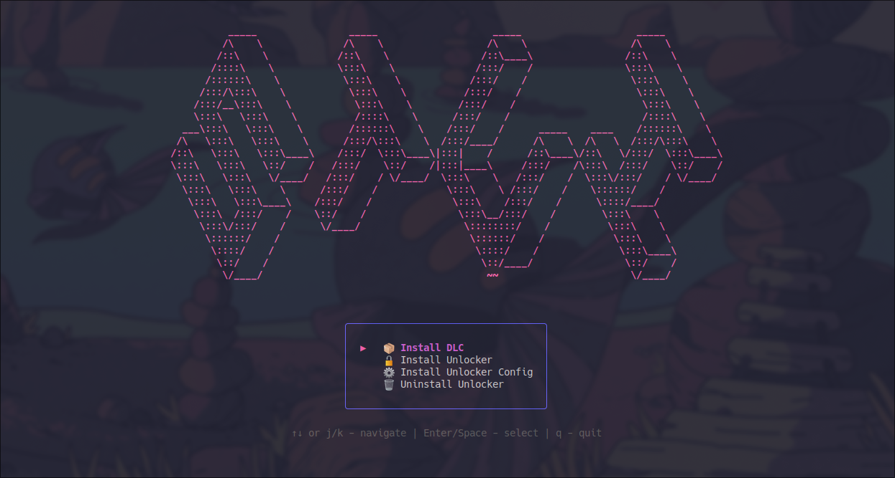

# STUI - The Sims 4 Terminal User Interface

A terminal-based utility for managing The Sims 4 DLCs, unlocker, and game configuration for Windows and Linux. More features coming in the future!



## Installation

### From Release

1. Download the latest release archive for your platform from the [Releases](https://github.com/hirotasoshu/stui/releases) page
2. Extract the archive to any location
3. Make sure the executable (`stui` or `stui.exe`) is in the same directory as the `unlocker` folder
4. Run the application:
   - **Windows**: Double-click `stui.exe` or run from command prompt (for unlocker installation, run as Administrator)
   - **Linux**: `chmod +x stui && ./stui`

### Building from Source

**Requirements:**

- Go 1.25 or higher

**Steps:**

```bash
# Clone the repository
git clone https://github.com/YOUR_USERNAME/stui.git
cd stui

# Build the executable
go build -o stui ./cmd/stui

# Run
./stui
```

For Windows:

```bash
go build -o stui.exe ./cmd/stui
```

## Features

- **Install DLCs via Torrent**: Download and install DLCs directly from a torrent source with real-time progress tracking
- **Install Unlocker**: Automatically install and configure the Anadius DLC unlocker (requires administrator rights on Windows)
- **Install Configuration**: Install The Sims 4 config for the unlocker
- **Interactive TUI**: Terminal interface built with Bubble Tea

## How It Works

### Install DLC (Torrent)

The application downloads selected DLCs from a torrent source and installs them to your game directory:

1. Select DLCs you want to install from the list
2. The app connects to the torrent network and begins downloading
3. Real-time progress bar shows download speed and completion percentage
4. Files are automatically moved from temp directory to game directory after download
5. Temp files are cleaned up automatically

All DLC files are sourced from the community torrent maintained by dixen18.

### Install Unlocker

Installs the Anadius DLC unlocker to enable all DLCs without purchasing them:

1. Downloads the latest unlocker files
2. Places them in the correct game directory structure
3. Configures the unlocker for your installation

**Note**: On Windows, you must run the application with administrator rights for this feature to work properly.

### Install Configuration

Installs The Sims 4 config file for the unlocker.

## Roadmap

1. Refactor code (currently this is more of a proof of concept)
2. UI/UX improvements
3. macOS support
4. Conflicting mods detection
5. Backup/restore for mods and saves

## Credits

- **[dixen18](https://rutracker.org/forum/viewtopic.php?t=5984608)** - for maintaining The Sims 4 torrent distribution on RuTracker
- **anadius** - for creating the DLC unlocker
- **[anacrolix](https://github.com/anacrolix)** - for the excellent [torrent package](https://github.com/anacrolix/torrent)
- **[Charm Bracelet](https://github.com/charmbracelet)** - for the amazing TUI libraries (Bubble Tea, Bubbles, Lip Gloss)
